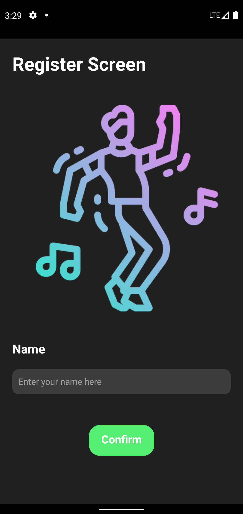
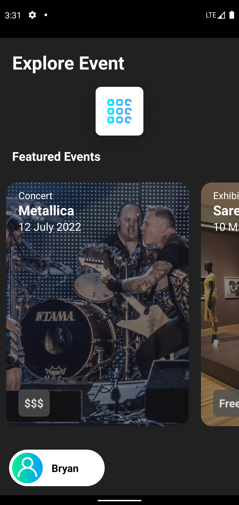
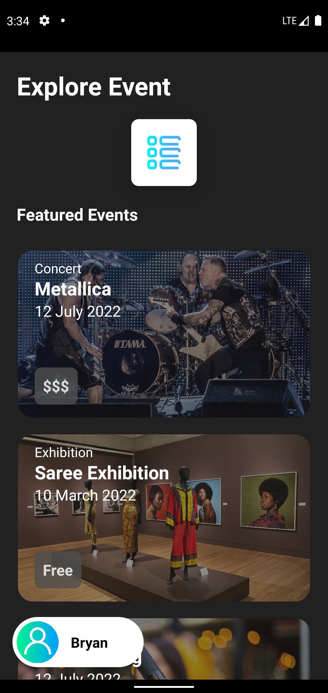
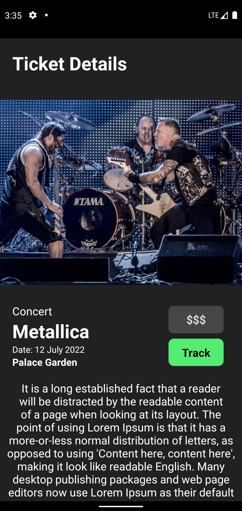

<div id="top"></div>
<!--
*** Thanks for checking out the Best-README-Template. If you have a suggestion
*** that would make this better, please fork the repo and create a pull request
*** or simply open an issue with the tag "enhancement".
*** Don't forget to give the project a star!
*** Thanks again! Now go create something AMAZING! :D
-->


<!-- PROJECT SHIELDS -->
<!--
*** I'm using markdown "reference style" links for readability.
*** Reference links are enclosed in brackets [ ] instead of parentheses ( ).
*** See the bottom of this document for the declaration of the reference variables
*** for contributors-url, forks-url, etc. This is an optional, concise syntax you may use.
*** https://www.markdownguide.org/basic-syntax/#reference-style-links
-->


<!-- PROJECT LOGO -->
<br />
<div align="center">
  <a href="https://github.com/othneildrew/Best-README-Template">
    
  </a>

  <h3 align="center">Ticketing KL</h3>

  <p align="center">
    Ticketing Mobile Application
    <br />
    <a href="https://github.com/FelisitusBryanChandra/ticketingKL"><strong>Explore the docs »</strong></a>
    <br />
    <br />
  </p>
</div>


<!-- TABLE OF CONTENTS -->
<details>
  <summary>Table of Contents</summary>
  <ol>
    <li>
      <a href="#about-the-project">About The Project</a>
      <ul>
        <li><a href="#built-with">Built With</a></li>
      </ul>
    </li>
    <li>
      <a href="#getting-started">Getting Started</a>
      <ul>
        <li><a href="#prerequisites">Prerequisites</a></li>
        <li><a href="#installation">Installation</a></li>
      </ul>
    </li>
    <li><a href="#usage">Usage</a></li>
    <li><a href="#contact">Contact</a></li>
  </ol>
</details>


<!-- ABOUT THE PROJECT -->
## About The Project

Ticketing KL is an app that allows you to track certain events that are shown in the app.
Ticketing KL is made with react native where currently it only works in android due to lack of development source in IOS.
The main library we use is react redux and react navigation, where react redux acts as a state management and react navigation helps to navigate through page and parameters.

<p align="right">(<a href="#top">back to top</a>)</p>


### Built With

* [React Native](https://reactnative.dev/)
* [Node.js](https://nodejs.org/en/)
* [React Navigation](https://reactnavigation.org/)
* [React Redux](https://react-redux.js.org/)

<p align="right">(<a href="#top">back to top</a>)</p>


<!-- GETTING STARTED -->
## Getting Started

To get your application going, i suggest you follow these steps by react native https://reactnative.dev/docs/environment-setup
### Prerequisites

To install all the dependencies and libraries, do install all the npm from the package.lock
* npm
  ```sh
  npm install
  ```

### Installation

_Below is an example of how you can instruct your audience on installing and setting up your app. This template doesn't rely on any external dependencies or services._

1. Clone the repo
   ```sh
   git clone https://github.com/FelisitusBryanChandra/ticketingKL.git
   ```
3. Install NPM packages
   ```sh
   npm install
   ```

<p align="right">(<a href="#top">back to top</a>)</p>


<!-- USAGE EXAMPLES -->
## Usage

This section will give you further details of how the app works


On the first page, we got a registration page as users have to enter his/her name. We validated the form with an alert message when users forgot to fill in the name text input.



After users fill in their name, users are allowed to navigate to the next page which is the home screen. Home screen can be scrolled horizontally or vertically through the grid and list button at the top. Each event card can be clicked to view further details of the event. At the bottom left we have the user’s name.


The ticket details page where users can view more detailed information of the event. In this page, users can view more information such as the address of the events, full description of the events and track button. But unfortunately, the track button is now not functional due to storage problems. I initially used asyncstorage to solve this problem, but it still doesn’t work. Because usually these kind of problems are solved with data in API. 

<p align="right">(<a href="#top">back to top</a>)</p>

<!-- CONTACT -->
## Contact

Felisitus Bryan Chandra - bryanchandra.SJM@gmail.com

Project Link: [https://github.com/FelisitusBryanChandra/ticketingKL](https://github.com/FelisitusBryanChandra/ticketingKL)

<p align="right">(<a href="#top">back to top</a>)</p>

